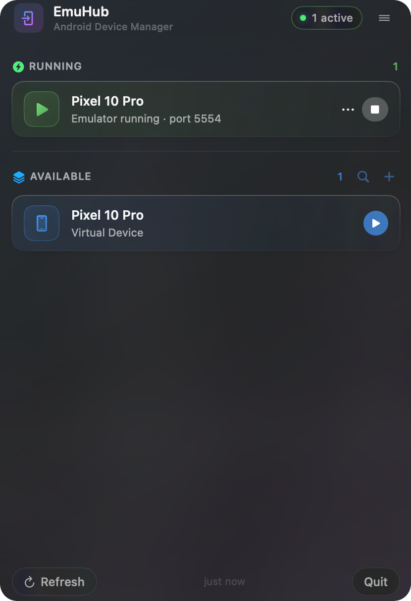

# EmuHub

EmuHub is a lightweight macOS **menu bar utility** for managing Android emulators (AVDs) and connected physical Android devices — with zero Terminal required.

Click the menu bar icon, launch an AVD, and monitor every connected device. That's it.

---

## Screenshots



---

## Features

### Emulator Management
- List all configured Android Virtual Devices (AVDs) with device-type icons — phone, tablet, TV, Wear OS, and Automotive
- Launch any AVD with a single click
- Cleanly stop running emulators via `adb emu kill`
- Running emulators display their resolved AVD name (e.g., "Pixel 7") and active port

### Physical Device Visibility
- Automatically detects connected physical Android devices over **USB** or **Wi-Fi** (ADB wireless debugging)
- Displays the real device model name (e.g., "Pixel 8 Pro") fetched via `adb shell getprop`
- Shows the Android version for each authorized device
- Correct tablet icon shown when the connected device is a tablet
- Clear status labels for unauthorized and offline devices with actionable guidance
- Connection type (USB / Wi-Fi) shown in the device status badge

### Device Actions
Each running emulator and authorized physical device exposes a **`•••` actions menu** (also available via right-click) and inline buttons on the device card:

- **Screenshot** — captures the current screen and saves a PNG to your Desktop, opening it in Finder
- **Screen recording** — records the screen via `adb shell screenrecord` (Android caps this at 3 minutes), saves the MP4 to your Desktop, and reveals it in Finder; a red indicator shows on the device tile while recording
- **Install APK** — drag-and-drop an `.apk` onto the device card to install it (`adb install -r`)
- **Reboot** — reboot normally, into **Recovery**, or into **Bootloader** (`adb reboot`)
- **Open adb Shell** — opens Terminal with an interactive `adb -s <serial> shell` session ready to go
- **Manage Apps** — opens a panel listing user-installed packages, each with **Launch**, **Force Stop**, **Clear Data**, and **Uninstall** actions
- **View Logs** — opens a live `adb logcat` viewer with color-coded priority badges, a minimum-level filter (Verbose → Fatal), tag/message search, pause/resume, clear, and copy- or save-to-Desktop export (rolling 5,000-line buffer)
- **Copy Serial / Copy Wi-Fi Address** — copies the device serial (or wireless address) to the clipboard

### Create & Manage AVDs
- Create a new AVD in-app from any installed system image and hardware profile (via `avdmanager`)
- Search/filter the AVD list
- Launch options per AVD: normal launch, **Cold Boot** (`-no-snapshot-load`), or **Wipe Data & Boot** (`-wipe-data`)
- **Delete an AVD** from the right-click menu, with a confirmation prompt (`avdmanager delete avd`) — blocked while the emulator is running

### Design
- Modern translucent (glassy) menu-bar UI with frosted-glass device cards, vibrancy background, and tinted device tiles that adapt to light and dark mode
- The glass treatment carries through every screen — Settings, Help, About, Software Update, and New AVD use the same frosted group cards, tinted glass icon tiles, and translucent input fields

### Keyboard Shortcut
- Press **⌥⌘X** (Option + Command + X) from anywhere to open or close the EmuHub popover
- Works globally when EmuHub is in the background (requires Accessibility permission in System Settings → Privacy & Security)
- Also works locally to dismiss the popover when it is already open (no extra permission needed)

### Settings & Configuration
- Auto-detect Android SDK path, or configure it manually
- Pass custom launch arguments to the emulator (e.g., `-no-snapshot-load -gpu host`)
- Configurable auto-refresh interval (3–60 seconds)
- Launch at login support (macOS 14+)

### Updates
- In-app update checker via GitHub Releases API
- Shows installed vs latest version with direct download link
- Auto-checks on first open of the Software Update page

---

## Installation

### macOS (Manual Install)

1. Download the latest `.zip` from **[GitHub Releases](https://github.com/mchigangawa/EmuHub/releases)**
2. Unzip and drag **EmuHub.app** into your **Applications** folder
3. On first launch, remove the quarantine attribute:

``` bash
sudo xattr -dr com.apple.quarantine /Applications/EmuHub.app
```

Then open EmuHub normally from Applications.

> **Note:** EmuHub is built via GitHub Actions and is currently **not notarized**.  
> macOS will show a security warning on first launch — this is expected behavior for unsigned apps.

---

## System Requirements

| Requirement | Detail |
|---|---|
| macOS | 14.0 Sonoma or newer |
| Android SDK | Installed at `~/Library/Android/sdk` (auto-detected) |
| adb | Included in `platform-tools` inside the SDK |
| Android Emulator | Included in `emulator` inside the SDK |
| Physical devices | Optional — USB or Wi-Fi (ADB wireless debugging) |

---

## Usage

### Starting an Emulator
1. Click the **EmuHub** icon in the menu bar
2. In the **Available** section, find the AVD you want to launch
3. Click **Launch** (or hover for the button to appear)
4. The emulator boots and appears in the **Running** section

### Stopping an Emulator
1. In the **Running** section, hover over the emulator row
2. Click **Stop** — EmuHub sends `adb emu kill` to cleanly terminate it

### Physical Devices
- Connected Android phones and tablets appear automatically in the **Running** section
- The device model name (e.g., "Samsung Galaxy S24") and Android version are shown
- Physical devices are **read-only** — Stop and Launch actions are not available for real hardware
- If a device shows **Unauthorized**, unlock the device and tap **Allow** on the USB debugging prompt
- If a device shows **Offline**, try a different cable (USB) or check your network (Wi-Fi), then run `adb kill-server` in Terminal
- If a Wi-Fi device appears twice, EmuHub automatically deduplicates the entries and shows only one

### Keyboard Shortcut
- Press **⌥⌘X** from anywhere to open or close EmuHub instantly
- To enable the global shortcut (opening from background): go to **System Settings → Privacy & Security → Accessibility** and enable EmuHub

### Software Update
- Open the menu (≡ icon) → **Software Update**
- EmuHub compares your installed version with the latest GitHub Release
- Click **Download** if a newer version is available

---

## Physical Device Handling

EmuHub intentionally treats physical devices as **read-only** to prevent accidental actions on real hardware.

| State | Meaning | Action Required |
|---|---|---|
| USB connected | USB debugging authorized over cable | None — device is visible |
| Wi-Fi connected | Wireless debugging active (Android 11+) | None — device is visible |
| Unauthorized | USB debugging prompt pending | Tap **Allow** on the device |
| Offline (USB) | adb can't reach the device over cable | Check USB cable; try `adb kill-server` |
| Offline (Wi-Fi) | adb can't reach the device over Wi-Fi | Check network connection; try `adb kill-server` |

To remove a USB device from the list: unplug the cable or disable USB debugging.
To remove a Wi-Fi device from the list: disable Wireless Debugging in Developer Options.

EmuHub fetches the device model and Android version via `adb shell getprop` and caches the result in-session — no repeated queries on each auto-refresh.

---

## Configuration

### Android SDK Path

EmuHub auto-detects the SDK at `~/Library/Android/sdk`. If you installed Android Studio elsewhere:

1. Open the menu → **Settings**
2. Under **Android SDK**, enter the full path to your SDK root
3. Click **Auto-detect** to let EmuHub find it automatically

The SDK root must contain `platform-tools/adb` and `emulator/emulator`.

### Emulator Launch Arguments

Customize startup behavior via **Settings → Emulator → Extra Launch Arguments**:

| Flag | Effect |
|---|---|
| `-no-snapshot-load` | Always cold-boot (ignore saved state) |
| `-gpu host` | Use the Mac's GPU for rendering |
| `-no-audio` | Disable audio output |
| `-wipe-data` | Factory-reset the AVD on launch |
| `-no-snapshot-save` | Don't save state on shutdown |

Separate multiple flags with spaces.

---

## Development

### Built With

- **Swift 6** · **SwiftUI**
- **macOS MenuBarExtra API** (window style)
- **Android adb** and **Emulator CLI** tools

### Run Locally

```bash
git clone https://github.com/mchigangawa/EmuHub.git
cd EmuHub
open EmuHub.xcodeproj
```

Build and run the `EmuHub` scheme. Requires Xcode 15+ and macOS 14+.

### Project Structure

```
EmuHub/
├── EmuHubApp.swift          # Entry point — MenuBarExtra + Settings scenes
├── AppState.swift           # Central ObservableObject — state, refresh, device enrichment
├── Models/
│   ├── AVD.swift            # Android Virtual Device model
│   └── RunningDevice.swift  # Connected device model (emulator or physical)
├── Services/
│   ├── AdbService.swift     # adb device listing, stop, property queries
│   ├── ADBParser.swift      # adb output parser, serial normalizer, deduplicator
│   ├── EmulatorService.swift# AVD listing and launch
│   ├── AndroidToolchain.swift # SDK path resolution
│   ├── Shell.swift          # Async process execution
│   └── ReleaseUpdateService.swift # GitHub Releases API
└── UI/
    ├── MenuBarRootView.swift # Main popover — navigation, home, device cards
    ├── SettingsView.swift    # Preferences
    ├── AboutView.swift       # About page
    ├── HelpView.swift        # FAQ / Help
    └── CheckForUpdatesPageView.swift # Software update
```

---

## Roadmap

See [CHANGELOG.md](CHANGELOG.md) for what's been released. Planned features include:

- ADB port forwarding management panel
- Device log (logcat) viewer
- Clipboard sync between Mac and Android device
- Homebrew cask installation

Suggestions and contributions welcome — see [CONTRIBUTING.md](CONTRIBUTING.md).

---

## License

MIT © Munyaradzi Chigangawa — see [LICENSE](LICENSE) for details.
